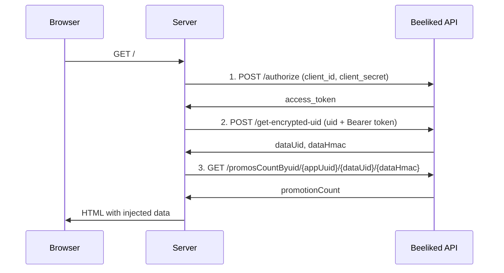
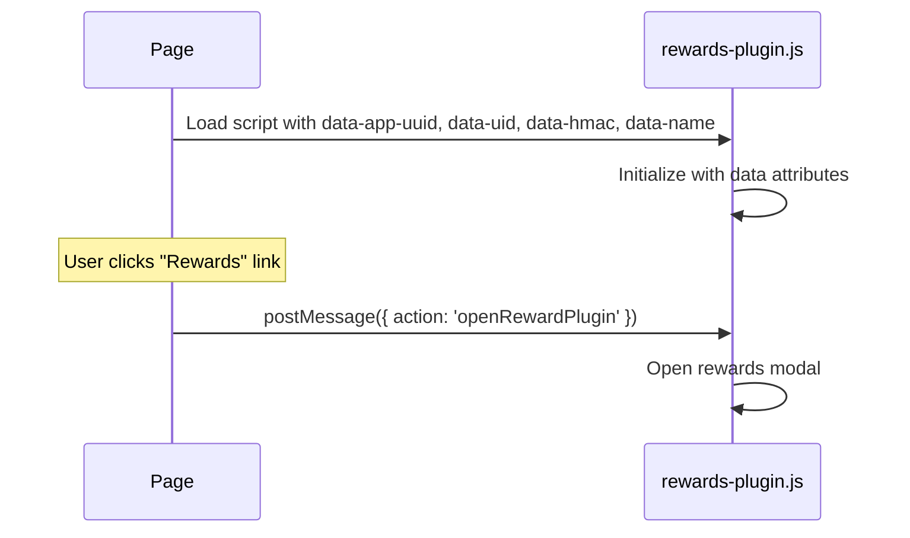

# Flow Diagram

### Server-Side (Netlify Function)

### Client-Side (Browser)

## Detailed Steps

### Step 1 - Authentication (server.js lines 16-21)

The server calls the Beeliked `/authorize` endpoint with `client_id` and `client_secret` from the config. It receives an `access_token` used for subsequent API calls.

### Step 2 - User Encryption (server.js lines 24-36)

Using the access token, the server calls `/get-encrypted-uid` with the user's `UID`. The API returns `dataUid` and `dataHmac` — encrypted credentials that the plugin uses on the frontend to identify the user securely.

### Step 3 - Promotion Count (server.js lines 39-42)

The server calls `promosCountByuid` to get how many promotions the user has. This value is displayed as a badge in the navbar (e.g., "Rewards 3").

### Step 4 - Render (server.js lines 44-52)

`res.render("index", {...})` injects all the fetched data into the EJS template.

### Step 5 - Script Injection (index.ejs lines 16-22)

A `<script>` tag loads `rewards-plugin.js` with these data attributes:

| Attribute | Purpose |
|-----------|---------|
| `data-app-uuid` | Application identifier |
| `data-uid` | Encrypted user ID |
| `data-hmac` | Authentication hash |
| `data-name` | User name displayed in the plugin |

### Step 6 - Opening the Modal (index.ejs lines 25-35)

The navbar contains a link with `id="rewardsLink"`. When clicked, it triggers `window.postMessage({ action: 'openRewardPlugin' }, '*')`. The external plugin listens for this message and opens the rewards modal.

## Files Involved

| File | Responsibility |
|------|-----------------|
| `netlify/functions/config.js` | Credentials and URLs (API, plugin, app UUID, user) |
| `netlify/functions/server.js` | Orchestrates API calls and renders the page |
| `views/index.ejs` | Main template; injects plugin script and click listener |
| `views/partials/navbar.ejs` | "Rewards" link with promotion count badge |

## Data Passed to the Frontend

- `pluginScriptUrl` — URL of the plugin script (e.g., rewards.beeliked.app/rewards-plugin.js)
- `dataAppUuid` — Application identifier
- `dataUid` / `dataHmac` — Encrypted user credentials
- `dataName` — User display name
- `promotionCount` — Number of promotions (for the badge)
