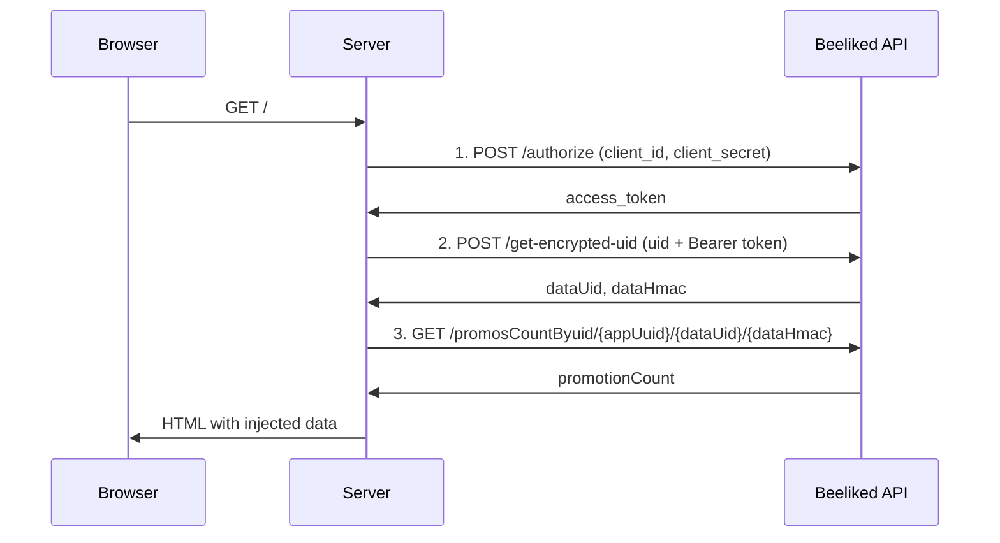
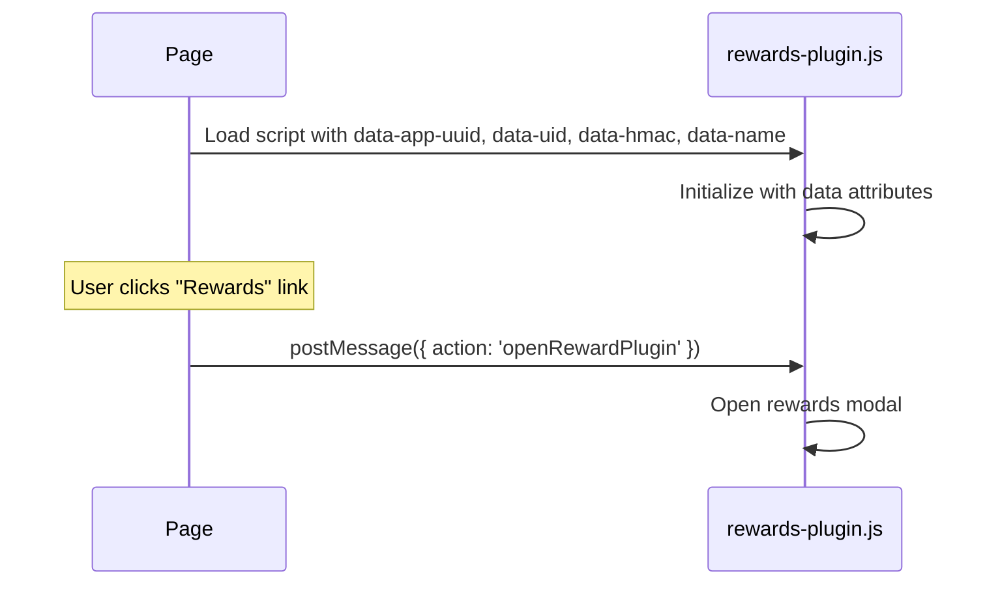

# Flow Diagram

### Server-Side (Netlify Function)


```mermaid
sequenceDiagram
    participant Browser
    participant Server
    participant API as Beeliked API

    Browser->>Server: GET /
    Server->>API: 1. POST /authorize (client_id, client_secret)
    API->>Server: access_token
    Server->>API: 2. POST /get-encrypted-uid (uid + Bearer token)
    API->>Server: dataUid, dataHmac
    Server->>API: 3. GET /promosCountByuid/{appUuid}/{dataUid}/{dataHmac}
    API->>Server: promotionCount
    Server->>Browser: HTML with injected data
```

### Client-Side (Browser)


```mermaid
sequenceDiagram
    participant Page
    participant Plugin as rewards-plugin.js

    Page->>Plugin: Load script with data-app-uuid, data-uid, data-hmac, data-name
    Plugin->>Plugin: Initialize with data attributes
    Note over Page: User clicks "Rewards" link
    Page->>Plugin: postMessage({ action: 'openRewardPlugin' })
    Plugin->>Plugin: Open rewards modal
```

## Detailed Steps

### Step 1 - Authentication (server.js lines 16-21)

The server calls the Beeliked `/authorize` endpoint with `client_id` and `client_secret` from the config. It receives an `access_token` used for subsequent API calls.

### Step 2 - User Encryption (server.js lines 24-36)

Using the access token, the server calls `/get-encrypted-uid` with the user's `UID`. The API returns `dataUid` and `dataHmac` — encrypted credentials that the plugin uses on the frontend to identify the user securely.

### Step 3 - Promotion Count (server.js lines 39-42)

The server calls `promosCountByuid` to get how many promotions the user has. This value is displayed as a badge in the navbar (e.g., "Rewards 3").

### Step 4 - Render (server.js lines 44-52)

`res.render("index", {...})` injects all the fetched data into the EJS template.

### Step 5 - Script Injection (index.ejs lines 16-22)

A `<script>` tag loads `rewards-plugin.js` with these data attributes:

| Attribute       | Purpose                           |
| --------------- | --------------------------------- |
| `data-app-uuid` | Application identifier            |
| `data-uid`      | Encrypted user ID                 |
| `data-hmac`     | Authentication hash               |
| `data-name`     | User name displayed in the plugin |

With the embed customization, additional `data-*` attributes are conditionally rendered by `index.ejs` based on the active embed type from `EMBED_STYLE_CONFIG`:

| Attribute           | Condition                 | Source                               |
| ------------------- | ------------------------- | ------------------------------------ |
| `data-embed-type`   | Always                    | `EMBED_STYLE_CONFIG.type`            |
| `data-width`        | If defined in embedConfig | `EMBED_STYLE_CONFIG[type].width`     |
| `data-height`       | If defined in embedConfig | `EMBED_STYLE_CONFIG[type].height`    |
| `data-position`     | If defined in embedConfig | `EMBED_STYLE_CONFIG[type].position`  |
| `data-game-mode`    | If defined in embedConfig | `EMBED_STYLE_CONFIG[type].gameMode`  |
| `data-trigger-id`   | If defined in embedConfig | `EMBED_STYLE_CONFIG[type].triggerId` |
| `data-default-view` | If defined                | `EMBED_STYLE_CONFIG.defaultView`     |

Props not defined for the active type (e.g., `data-position` for `standard`) are omitted from the rendered HTML entirely.

### Step 6 - Opening the Modal (index.ejs lines 25-35)

The navbar contains a link with `id="rewardsLink"`. When clicked, it triggers `window.postMessage({ action: 'openRewardPlugin' }, '*')`. The external plugin listens for this message and opens the rewards modal.

## Files Involved

| File                          | Responsibility                                          |
| ----------------------------- | ------------------------------------------------------- |
| `netlify/functions/config.js` | Credentials and URLs (API, plugin, app UUID, user)      |
| `netlify/functions/server.js` | Orchestrates API calls and renders the page             |
| `views/index.ejs`             | Main template; injects plugin script and click listener |
| `views/partials/navbar.ejs`   | "Rewards" link with promotion count badge               |

## Data Passed to the Frontend

- `pluginScriptUrl` — URL of the plugin script (e.g., rewards.beeliked.app/rewards-plugin.js)
- `dataAppUuid` — Application identifier
- `dataUid` / `dataHmac` — Encrypted user credentials
- `dataName` — User display name
- `promotionCount` — Number of promotions (for the badge)
- `embedType` — Active embed type (`popup`, `slide`, or `standard`)
- `embedConfig` — Object with the active type's props (`width`, `height`, `position`, `gameMode`, `triggerId`)
- `defaultView` — Initial rewards view (`cards` or `list`)

## Embed Type Customization

The plugin supports three embed types, each with its own set of props. The active type is controlled by `EMBED_STYLE_CONFIG.type` in `config.js`.

### Available Embed Types

| Type       | Description                          | Specific Props                                         |
| ---------- | ------------------------------------ | ------------------------------------------------------ |
| `popup`    | Centered modal overlay with FAB      | `width`, `height`, `position`, `gameMode`, `triggerId` |
| `slide`    | Side panel (left or right) with FAB  | `width`, `height`, `position`, `gameMode`, `triggerId` |
| `standard` | Always-visible inline embed (no FAB) | `height`                                               |

### Switching Embed Types

Change only the `type` field in `config.js`:

```js
// 'popup' | 'slide' | 'standard'
export const EMBED_STYLE_CONFIG = {
  type: "popup",
  defaultView: "cards", // 'cards' | 'list'
  // ...
};
```

### Props Reference

| Prop                | Applies to   | Default                    | Description                                                           |
| ------------------- | ------------ | -------------------------- | --------------------------------------------------------------------- |
| `data-embed-type`   | all          | `popup`                    | Embed mode                                                            |
| `data-width`        | popup, slide | `600px` / `380px`          | Width of the panel or modal                                           |
| `data-height`       | all          | `80vh` / `100vh` / `600px` | Height                                                                |
| `data-position`     | popup, slide | `bottom-right`             | FAB position (`top-right`, `top-left`, `bottom-left`, `bottom-right`) |
| `data-game-mode`    | popup, slide | `fullscreen`               | How games open (`fullscreen` or `inline`)                             |
| `data-trigger-id`   | popup, slide | —                          | Custom trigger element ID (replaces FAB)                              |
| `data-default-view` | all          | `cards`                    | Initial rewards view (`cards` for carousel or `list` for table)       |
